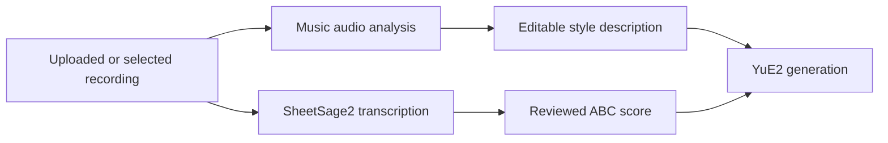

# Automatic style from source audio

Research date: 2026-09-20. The first configured-provider audio-analysis path is
now implemented locally, unreleased. See the [music guide](../MUSIC.md#auto-style-from-audio-unreleased)
for current behavior and [continued Suno/Udio/Lyria 2 research](music-generation-improvements.md)
for prioritized follow-ups. No local analysis model was installed.

## What Suno actually documents

Several different behaviors can look like automatic style detection:

| Behavior | Public evidence | What it establishes |
| --- | --- | --- |
| Reuse an existing generated song | [Reuse Prompt](https://help.suno.com/en/articles/2417409) repopulates the previous song's details, including style | Some apparent detection is reuse of saved input metadata |
| Preserve a musical identity | [Personas](https://help.suno.com/en/articles/3484161) carry vocals/style and populate the style field | A reusable source-song profile and automatic text filling exist; the encoder is not described |
| Use uploaded sound as guidance | [Creative Sliders](https://help.suno.com/en/articles/6141377) distinguish Audio Influence from Style Influence | Audio and written style can influence the result separately |
| Infer characteristics across songs | [Inspire](https://help.suno.com/en/articles/6882753) describes deriving mood, tempo and instrumentation from a playlist | Source music can guide a new composition without manually describing every characteristic |
| Interpret multiple references | The [v6 FAQ](https://help.suno.com/en/articles/13924481), updated September 9, 2026, describes song/upload/playlist references and automatic workflow selection; Variety can modify style prompts | Current behavior includes an orchestration/prompt-editing layer as well as music generation |

The older help articles explain specific controls and workflows; they should not
be treated as an exact description of today's v6 UI. The current FAQ does not
publish the model architecture either.

These sources are consistent with the user's observation that a reference can
supply the musical direction when style text is blank. They do not specify the
exact blank-field fallback, identify a genre classifier or captioning model, or
establish that generated style labels are always correct. No controlled Suno
session was performed for this research.

## Technical interpretation

My inference is that source-audio conditioning explains much of the behavior,
potentially combined with metadata reuse and audio-to-text description. The model
does not necessarily need to convert every characteristic into visible genre
tags before generating. A learned representation of a recording can retain
timbre, groove and other musical information that a short description omits.

This is a known family of techniques, not a disclosed Suno implementation.
[MusicLM](https://arxiv.org/html/2301.11325v1) provides a published example of
learning generation conditioned on music embeddings. Its training uses MuLan
audio representations; its text-generation inference path uses corresponding
text representations. This demonstrates the principle, not that Suno uses MuLan.

Audio description is a separate task: an audio encoder supplies features to a
language model, which writes a caption or structured musical profile. That can
produce visible styles, but it is not equivalent to directly conditioning a
generator on the recording. Neither technique needs to identify a song title in
a catalog first; it can operate on an unpublished recording.

## Implications for MooshieUI

Current source was checked during this investigation:

- `src/lib/utils/musicReference.ts` builds a text-only request from catalog and
  Wikipedia information and explicitly says no audio was supplied.
- `src-tauri/src/templates/music.rs` sends style, lyrics and optional ABC to YuE2.
- Generated songs retain their original parameters, and `reuseScore()` in
  `src/lib/stores/music.svelte.ts` can restore those parameters.

The official [YuE2 generation interface](https://github.com/multimodal-art-projection/YuE/blob/main/skills/yue2-music/references/generation-and-covers.md)
accepts text style, lyrics and a symbolic score; it does not expose a
`reference_audio` input. Our current cover path uses audio transcription to
produce ABC. A score preserves selected musical structure, not the recording's
complete timbre, production or singer identity.

The practical addition is audio analysis that creates the missing style text:

This adds the convenience of automatic style input while retaining
YuE2's existing interface. It does not establish parity with Suno's source-audio
fidelity or add a meaningful native Audio Influence control by itself.

## Candidate analysis backends

| Candidate | Relevant capability | Evaluation concern |
| --- | --- | --- |
| [MOSS-Music-8B-Instruct](https://github.com/OpenMOSS/MOSS-Music) | Dedicated audio encoder plus adapter and language model; descriptions of genre, mood, instrumentation, vocals, structure and production | Roughly 9.1B total parameters including the encoder; the recommended serving setup uses CUDA. Published comparisons are the authors' evaluations, not local performance evidence |
| [Music Flamingo](https://research.nvidia.com/labs/adlr/MF/) | Music-specialized audio-language model supporting detailed captions, instrument/genre recognition and long recordings | Benchmark accuracy does not guarantee exact instruments, BPM or production claims for a user's recording; local memory and latency require measurement |
| [Gemini audio understanding](https://ai.google.dev/gemini-api/docs/audio) | Hosted audio input with descriptions, questions and segment analysis | Requires an audio-capable provider route, credentials and an explicit cloud-audio setting; avoids requiring a local inference GPU |
| [LAION CLAP](https://github.com/LAION-AI/CLAP) | Audio/text embeddings for similarity and ranking candidate descriptions | Useful for candidate tags, not a complete free-form musical analyst; similarity scores are not calibrated probabilities |
| [MERT2 FullSong](https://huggingface.co/m-a-p/MERT-v2-FullSong) | Music features over a recording | Its standard output is embeddings. Genre/instrument/mood predictions need appropriate trained heads; downloading the encoder alone does not provide a captioner |

For a first prototype, compare a configured audio-capable hosted model against a
dedicated local captioner. Select a default from measured latency, memory and
accuracy, rather than reported leaderboard rank. Do not assume the published
CUDA setups work on Windows or Apple Silicon without testing. A remote analysis
backend can serve desktop clients on all platforms.

## Original proposal and implementation status

The implemented first version uses an explicit Analyze action, an editable
preview and Apply/Undo. It sends actual audio through an audio-input OpenRouter
model or compatible Custom endpoint, with no title-based fallback. It processes
the complete track up to six minutes and preserves blank-lyrics instrumental
intent. Session caching uses source identity, target and provider; returned
profiles also carry an audio SHA-256 and analyzer identity. Persistent profile
storage, hash-based reuse across uploads, excerpt selection and a dedicated
saved-prompt reuse shortcut remain follow-ups. Existing score/song reuse already
restores the original generation parameters.

The broader original proposal was:

1. Offer **Auto style from audio** when a recording is explicitly chosen as the
   source. An unrelated song selected for playback should not silently become a
   generation reference.
2. When enabled and style is blank, analyze the recording and show an editable
   description. Never replace manually written style automatically.
3. For generated songs, offer immediate reuse of the saved style. Label it as
   the original generation prompt. Analyze the rendered audio separately when
   the user wants its actual characteristics; the two can differ.
4. Analyze representative sections or the complete track within a bounded
   budget. A quiet intro alone may misrepresent the main arrangement. Use
   dedicated beat/key analysis where precision matters and retain uncertainty.
5. Cache results by audio hash and analyzer/version, scoped to the account.
   Uploaded-source analysis follows the source's temporary lifetime; a saved
   generated song can retain its profile. Cancel or discard late results after
   source replacement, account changes or teardown.
6. Keep the source description separate from the requested output. Blank target
   lyrics still mean instrumental: detected source vocals must not silently
   re-enable vocals in the generated style.

Before shipping, test silent/broken files, instrumentals, sparse vocals, live
recordings, different languages, genre changes within a track and similar
instrument timbres. Evaluate human-rated description accuracy separately from
how well YuE2 follows that description. Neither model self-confidence nor a
successful request is proof of musical correctness.
