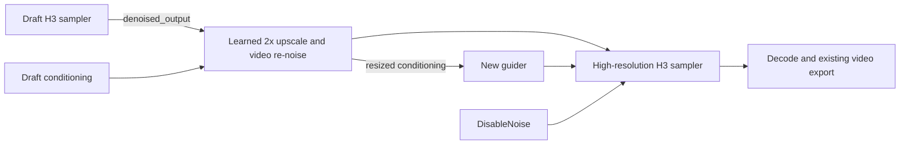

# Video generation improvement research

Reviewed and implemented 2026-09-15. Source investigation covers upstream code, example graphs, release announcements and revision-pinned model manifests. The working tree now includes the three selected follow-ups: INT8 VDN, current LightX2V presets, and retained drafts with experimental 2× refinement. A [live RTX 5070 comparison](video-benchmark-2026-09-15.md) now covers generation methods and records VDN compatibility failures. Other hardware and 2× refinement remain unqualified by live rendering.

**Post-benchmark update:** VDN has been removed from the selectable options; saved VDN selections fall back to Standard. The prompt enhancer and Live2D guidance now use concise motion briefs and quick natural blinks. The VDN investigation below records the earlier implementation and its unresolved limitations.

## Current addition

The working tree now offers Standard/Turbo selection, three task-aware LightX2V presets, concise motion prompting and a retained-draft gallery workflow. VDN backend/history support remains, but its selection and installation controls have been removed. Existing Larryvrh Turbo, TeaCache, prompt guidance, reference inputs, the shot timeline, RIFE/GMFSS interpolation, playback and export were already present. See [the user guide](../VIDEO.md) for setup and limits.

VDN uses the original OpenVDN eight-step checkpoint and the portable ComfyUI node. SGLang's eight-B200 result is a different runtime and hardware configuration. The [OpenVDN repository](https://github.com/OpenVDN/vdn-minimax-h3) and [SGLang announcement](https://x.com/sgl_project/status/2099536367508402480) describe those workloads. In the [RTX 5070 measurements](video-benchmark-2026-09-15.md), INT8 VDN was slower than Standard and Turbo, and BF16 streaming crashed the backend.

## Ranked follow-ups

Priority reflects likely benefit to MooshieUI users and integration risk, not a measured performance ranking. Rows 2–4 are now implemented as opt-in options; their GPU qualification work remains. Other rows remain proposals.

| Priority | Improvement | Expected user benefit | Evidence and work needed |
|---|---|---|---|
| 1 | Compare generation methods on the user's GPU | Choose a method using actual speed, memory and output quality | Reuse queue timings and gallery video output. Add a reviewed, bounded comparison of Standard, Turbo and VDN with fixed input settings; record warm/cold runs separately. This is a product proposal, not a new model dependency. |
| 2 | Named LightX2V Turbo presets | More few-step quality/speed choices with settings that match each adapter | [LightX2V's model card](https://huggingface.co/lightx2v/Minimax-h3-Turbo) and [ModelTC's specification](https://github.com/ModelTC/Minimax-H3-Turbo) publish alternative adapters. Inspect each file's target variant, strength, sigma shifts and sampler; do not assume our existing Larryvrh sampler is interchangeable. Validate generated audio as well as video. |
| 3 | INT8 VDN branch option | Reduce the additional VDN memory and download burden | [Converted checkpoint](https://huggingface.co/drbaph/vdn-minimax-h3-int8-convrot-comfyui). The [port's notes](https://github.com/Saganaki22/ComfyUI-VDN-H3#required-models) report a smaller branch. Add a separate pinned manifest and explicit checkpoint choice, then compare quality and peak memory against the original branch. Do not silently substitute a community conversion. |
| 4 | Generate a draft, then upscale the chosen video | Iterate at lower resolution and spend the larger render cost on selected clips | [H3 latent upscaler](https://github.com/Tr1dae/ComfyUI-MiniMaxH3_LatentUpscaler) supports a learned 2× path and a second sampling pass. H3 combines video/audio latents, so a generic image upscaler is insufficient. Preserve audio, rescale reference conditioning, and validate temporal detail and identity. This requires a dedicated workflow and possibly saved intermediate latents. |
| 5 | Profile and improve H3 decode memory | Reduce failures at the final decode and identify time spent after sampling | Inspect [ComfyUI v0.35.0's H3 VAE](https://github.com/Comfy-Org/ComfyUI/blob/v0.35.0/comfy/ldm/minimax/vae.py). H3 handles tiling internally; replacing `VAEDecode` with `VAEDecodeTiled` does not by itself guarantee a different memory path. Investigate actual allocation and offloading before adding a control. |
| 6 | H3-specific MotionCache | Potentially skip more work during Standard sampling | [MotionCache/FastVAE implementation](https://github.com/Mozer/ComfyUI-MiniMax-H3-MotionCache-FastVAE) documents approximate residual reuse. Measure against the existing TeaCache option. Check moving faces, hands, text, lip sync and audio; avoid stacking caches or applying them to VDN without qualification. |

## Findings that change the recommendation

- **A faster-looking decoder is not automatically faster.** The [FastVAE maintainer](https://github.com/Mozer/ComfyUI-MiniMax-H3-MotionCache-FastVAE#minimax-h3-fast-vae-decode) reports a matched example where batching spatial tiles took 11.15 seconds versus 10.36 seconds for the standard path. It can also use more memory. Keep this as a benchmark candidate rather than adding an unconditional “fast decode” switch.
- **VDN's experimental compiled kernels are not a default.** The [port's benchmark notes](https://github.com/Saganaki22/ComfyUI-VDN-H3/blob/main/Benchmarks.md) record output drift for the optional compiled path. The integration uses the basic node, grouped attention and merged adapters.
- **The existing prompt guide already covers H3 formats.** `src/lib/utils/h3Prompt.ts` separates base and reference formats and includes the snapped frame duration. Improving reference/timeline-aware assistance should extend that implementation, rather than adding another disconnected writer.
- **Remote SGLang is a larger project.** It would require a second video backend, job submission/status/cancellation, input uploads and output ingestion. Keep it separate from the current ComfyUI integration; importing a ComfyUI node cannot reproduce SGLang's distributed runtime.

## Investigation: LightX2V Turbo presets

**Recommendation: add curated, mode-aware presets alongside the existing Larryvrh Turbo.** This is a moderate extension of the current workflow. It does not require running a separate LightX2V service.

The GitHub guide is behind the model releases. The publisher's September announcements document FL2V four-step v1.2 and Ref2V eight-step v1.0. Use those announcements together with the example graphs, rather than deriving settings from a filename or version number.

| Proposed preset | Base/task | Steps | Video/audio shift | Evidence |
|---|---|---|---|---|
| LightX2V 4-step v1.2, 768p | FL2VA; text, first-frame and first/last-frame generation | 4 | 6 / 3 | [Publisher's v1.2 release](https://huggingface.co/lightx2v/Minimax-h3-Turbo/discussions/52); audio improvement is an upstream claim |
| LightX2V 8-step v1.0, 768p | FL2VA | 8 | 6 / 3 | [Publisher's 8-step release](https://huggingface.co/lightx2v/Minimax-h3-Turbo/discussions/48) and [model specification](https://github.com/ModelTC/Minimax-H3-Turbo#1-model-specs) |
| LightX2V Reference 8-step v1.0, 768p | Ref2VA | 8 | 12 / 3 | [Publisher's reference release](https://huggingface.co/lightx2v/Minimax-h3-Turbo/discussions/51) |
| Optional Reference 4-step v0.1, 544p | Ref2VA | 4 | 12 / 3 | [Earlier model specification](https://github.com/ModelTC/Minimax-H3-Turbo#1-model-specs); useful comparison candidate, lower priority |

Keep older FL2V v1.0/v1.1 files available through advanced selection if needed; they are not necessary initial downloads. Prefer neutral version/step labels until our own comparisons establish quality differences.

### Exact files and workflow

The [model manifest](https://huggingface.co/api/models/lightx2v/Minimax-h3-Turbo/revision/3ec17a324ced54151364f24f8b5fb6bf7e26414f?blobs=true) lists these ComfyUI files at revision `3ec17a324ced54151364f24f8b5fb6bf7e26414f`. Each is **1,956,193,000 bytes** (1.96 GB / 1.82 GiB); install only the chosen preset.

- `minimax_h3_fl2v_turbo_4step_v1.2_768p_comfyui_bf16.safetensors`
- `minimax_h3_fl2v_turbo_8step_v1.0_768p_comfyui_bf16.safetensors`
- `minimax_h3_ref2v_turbo_8step_v1.0_768p_comfyui_bf16.safetensors`
- Optional: `minimax_h3_ref2v_turbo_4step_v0.1_comfyui_bf16.safetensors`

The [upstream ComfyUI graph](https://github.com/ModelTC/Minimax-H3-Turbo/blob/02e26d591f7a04d5d1a074c9566d5dd4f22f6225/example_workflows/video_minimax_h3_t2v_lightx2v_turbo.json) uses `LoraLoaderModelOnly` at strength 1, then `MiniMaxH3SigmaShift`, feeding both `BasicScheduler` and `BasicGuider`; sampling uses `euler`, `simple`, and denoise 1. The [native shift node exists in our ComfyUI v0.35.0 pin](https://github.com/Comfy-Org/ComfyUI/blob/v0.35.0/comfy_extras/nodes_minimax_h3.py#L365). Probe connected `/object_info` for those capabilities, including on remote servers. This path uses generic ComfyUI LoRA files, not the similarly named Diffusers files.

Local integration points and decisions:

1. Add a preset identifier to `h3Models.ts`, the generation store, `GenerationParams` and video metadata. Preserve the current Larryvrh preset for existing saved settings. A preset should own its file, compatible base variant, exact step count, sampler and shifts.
2. In `templates/video.rs`, branch LightX2V away from `MiniMaxH3TurboLoRA` / `MiniMaxH3TurboSampler`. Merely replacing the current LoRA filename keeps the wrong sampler behavior for FL2V's 6/3 recipe.
3. Apply the selected shifts consistently to the final model. Our bundled `minimax_director.py` applies its own `MiniMaxH3SigmaShift`, and `video.rs` currently passes 12/3. A 6/3 patch before Director alone would be overwritten. Use preset shifts in Director and verify scheduler/guider consume its returned model.
4. Match the adapter to the effective FL2VA/Ref2VA task, including Director's mode selection. Preserve reference resizing at `match` initially. Do not infer compatibility from safetensors metadata alone: the inspected Ref2V eight-step header names an FL2VA base even though its publisher explicitly releases it for Ref2V.
5. Keep LightX2V exclusive with VDN and Larryvrh acceleration. Qualify extra style LoRAs and caching separately. Save the actual preset and sampling recipe so a gallery rerun can reproduce the configuration.

The measured benefit is still unknown on our hardware. Four/eight evaluations reduce sampling work relative to Standard, but model loading, text encoding and AV decoding remain. The extra adapter is also larger than our existing roughly 780 MB Larryvrh download. Test visual detail and motion as well as dialogue, music and sound effects before changing defaults.

## Investigation: INT8 VDN branch

**Recommendation: make this the first follow-up implementation, as an explicit VDN precision choice.** Our pinned `ComfyUI-VDN-H3` revision already reads the converted branch and accepts its `adapter_config.json` layout. The required backend change is selecting and installing a second checkpoint manifest, not implementing quantization.

The [INT8 model manifest](https://huggingface.co/api/models/drbaph/vdn-minimax-h3-int8-convrot-comfyui/revision/3dc26acabfa4cfc808faf6be0bf20b5e070897a4?blobs=true) gives the following sizes. Totals include the branch, both adapters and their required JSON files; they exclude previews and repository metadata.

| Required files | Original BF16 | INT8 ConvRot |
|---|---:|---:|
| Linear branch | 4,279,428,112 bytes | 2,304,371,056 bytes |
| Complete stage download | 5,464,956,569 bytes | 3,489,899,513 bytes |
| Complete stage, decimal GB | 5.46 GB | 3.49 GB |
| Complete stage, binary GiB | 5.09 GiB | 3.25 GiB |

That is **1.98 GB / 36.1% less additional download**, calculated from the manifests. The model card mixes size units; use manifest-derived sizes in the UI. This quantizes the extra VDN branch, not the base H3 model or every part of generation. File size is not a minimum VRAM requirement.

The [converter's A/B report](https://huggingface.co/drbaph/vdn-minimax-h3-int8-convrot-comfyui) reports approximately 111 seconds versus 95 seconds with one run per version, eight steps, `er_sde` / `beta`, merged adapters and GPU-cached branch weights. It reports matching visual output and lower peak memory. This is encouraging evidence, but it does not establish a repeatable speedup or unchanged quality across prompts; audio needs explicit comparison too. Our automatic streaming policy may behave differently from that benchmark's forced caching.

### Concrete implementation scope

- Pin INT8 model revision `3dc26acabfa4cfc808faf6be0bf20b5e070897a4`. Use a separate directory such as `models/vdn/stage-dmd-step-250-int8-convrot/` so an explicit precision choice cannot switch silently.
- Download `model_spec.json`, `linear_branch/config.json`, `linear_branch/model_int8_convrot_comfyui.safetensors`, and both adapters' `adapter_config.json` / `adapter_model.safetensors`. INT8's repository has these at its root, unlike OpenVDN's `stage-dmd-step-250/` prefix.
- Branch SHA-256: `1fa18c3ebd94caa804ae3dc3a93df7ae069d8f5c363a00b6eb5288112c0f5abc`. Both adapter weight hashes match those already pinned in `h3_vdn.rs`; they are unchanged files. Keep separate complete folders initially; hard-link deduplication is optional later work.
- Extend `h3_vdn.rs` status/install calls to take the selected precision and check its own files and live checkpoint dropdown. Today `CHECKPOINT`, download URL, completeness and readiness are fixed to BF16. Preserve existing BF16 settings during migration.
- Add a VDN precision selection in the UI, persistence, IPC/server arguments and generation metadata. Pass its checkpoint to `ApplyVDNH3`; keep eight steps, `er_sde` / `beta`, merged adapters and the existing GGUF guard.
- Confirm the connected environment has the required Comfy Kitchen INT8 support. The [pinned loader](https://github.com/Saganaki22/ComfyUI-VDN-H3/blob/3eb63496c24ca70faaf8a14b6c75fcb480e34bf1/vdn_h3/spec.py) reconstructs `TensorWiseINT8Layout` with ConvRot. A checkpoint appearing in a dropdown proves discovery, not successful quantized execution.

Qualification should cover FL2VA and Ref2VA, BF16/INT8 switching, auto streaming under memory pressure, repeat renders and cancellation. Include paired warmed renders using the same base precision. Do not extrapolate the publisher's cached-branch result to every GPU or remote installation.

## Investigation: draft then 2x upscale

**Recommendation: prototype the complete two-pass graph, then add persistent drafts for the user-facing workflow.** This has the largest product scope of the three candidates.

The [Mamad8 architecture documentation](https://github.com/mamad8c/ComfyUI-H3-Latent-Upscaler-Mamad8) explains that its learned model transfers a clean H3 latent to a grid with twice the width and height. It is a preparation step for further generation: decoding it directly can look softer. Frame count remains unchanged. A draft at 672x384 could continue at 1344x768; 960x544 could continue at 1920x1088. Pixel area becomes four times larger, so high-resolution sampling/decode still needs an appropriate memory budget.

The inspected [Tr1dae integration](https://github.com/Tr1dae/ComfyUI-MiniMaxH3_LatentUpscaler/tree/895e3c471164423f0ea0e8eaf45eb701efe641ae) depends on sibling package `ComfyUI-H3-Latent-Upscaler-Mamad8` (inspected revision `e98237773011523528353a8beb4863e65b099a38`). Its default film checkpoint is only **59,022,848 bytes** (59 MB), confirmed by the [model manifest](https://huggingface.co/api/models/Tridae/H3LatentUpscaler/revision/5c87ab7cf8425a2cfbc3d21da1bffbd686ce67a6?blobs=true). The loader's SHA-256 matches the manifest: `984afb58f11d01274b90d880596ce2f93bc9c512db66fdeecd4e2d99b371d3e4`. Small weights do not make the second H3 pass cheap.

### Workflow prototype

The [Combined node contract](https://github.com/Tr1dae/ComfyUI-MiniMaxH3_LatentUpscaler/blob/895e3c471164423f0ea0e8eaf45eb701efe641ae/nodes.py) provides the latent and updated conditioning required for continuation:

Use `SamplerCustomAdvanced` output 1 for the clean draft latent. Our current builder decodes output 0 directly and has no continuation branch. Combined injects noise using the selected pass-two sigmas, so the second sampler must use `DisableNoise` and those same sigmas. Rebuild its guider from Combined's resized references/keyframes. Start with audio locked (`audio_denoise=0`), while preserving Director's custom audio route when one is selected.

The [scheduler implementation](https://github.com/Tr1dae/ComfyUI-MiniMaxH3_LatentUpscaler/blob/895e3c471164423f0ea0e8eaf45eb701efe641ae/schedulers.py) shows why a denoise value is not portable between schedules: it can produce a different starting sigma. Establish a working non-ancestral continuation recipe with Standard H3 first. Treat Turbo or VDN continuation, unusual reference layouts and combined caching as separate qualification work; an eight-step generation preset is not automatically an eight-step refinement recipe.

### What a useful product implementation needs

1. **A working same-job prototype:** compile the two passes in `templates/video.rs`, use the existing decode/interpolation/export tail, and validate dimensions, preserved audio, reference identity and motion. Compare against a native render at the final resolution, including total time and peak memory. No persistent draft feature should ship before this demonstrates useful quality.
2. **Retain selectable drafts:** save joint video/audio latents and conditioning alongside a gallery draft record. The current MP4 output cannot exactly reconstruct them. Keep model/preset versions, seed, dimensions, frame count and reference/timeline provenance; invalidate or rebuild conditioning when those inputs change.
3. **A gallery action:** expose “Upscale draft 2x” only for records with compatible retained data, show the actual output dimensions, and save the HQ result linked to its draft. Let users delete retained data separately from their MP4; handle missing data clearly.
4. **Desktop and remote support:** retained data belongs to the ComfyUI server that generated it. Use server-issued identifiers and the existing IPC abstraction for status, queueing and cleanup. Do not build the feature around client-local paths or the external node pack's canvas widgets.

The upstream package persistence is not ready to adopt unchanged: [`stash.py`](https://github.com/Tr1dae/ComfyUI-MiniMaxH3_LatentUpscaler/blob/895e3c471164423f0ea0e8eaf45eb701efe641ae/stash.py#L678) loads `conditioning.pt` with `weights_only=False`. Our proposed draft format should use tensors plus a validated data schema and reject arbitrary imported pickle files. The package also registers its own browser routes/editor. Decide whether to integrate a reviewed subset or our own minimal persistence nodes instead of assuming installing the package gives us a MooshieUI gallery workflow.

Continuous-shot chunking is also unresolved: the [package initializer](https://github.com/Tr1dae/ComfyUI-MiniMaxH3_LatentUpscaler/blob/895e3c471164423f0ea0e8eaf45eb701efe641ae/__init__.py) leaves the chunked sampler unregistered because cross-chunk consistency failed. Keep the first qualification pass within memory-fitting clips; do not promise long-video upscaling through chunking.

## Implementation status

1. **VDN BF16/INT8 selection was implemented, then removed from the UI after benchmarking.** Separate manifests, checkpoint folders, settings and live readiness checks preserve the selected precision. Both choices retain the existing eight-step VDN recipe and exclude GGUF merging.
2. **All three current LightX2V presets are implemented.** The selected task determines compatible presets. Each fixes its adapter, step count, Euler/simple sampling and video/audio shifts, including Director workflows. Downloads are revision-pinned and SHA-256 checked. Saved Larryvrh settings keep their original route.
3. **Retained drafts and a 2× gallery action are implemented as experimental.** MooshieUI owns the minimal persistence/continuation nodes and vendors the MIT Mamad8 architecture. The pinned 59 MB film checkpoint has been downloaded and executed on CPU. Persistence uses JSON plus safetensors; no imported pickle or external stash editor is used. Gallery-owned records retain server/worker affinity through save and rename, remote outputs use ComfyUI's view API, and queued refinements prevent draft deletion.

The continuation uses clean video upscaling, resized visual references, a new guider and one native noise injection. A fresh Standard H3 model uses Euler with a linear raw-sigma schedule (default 0.35 to zero over eight steps). An audio mask and explicit original-audio restoration preserve the draft soundtrack. This establishes a concrete, testable workflow; the user-facing experimental label remains until full GPU comparisons establish quality and memory behaviour. No H3/VDN/LightX2V multi-gigabyte weights were downloaded for these checks.

## Local qualification before changing defaults

Use synthetic, shareable prompts and retain the same base model, seed, dimensions, frame count, inputs and output settings for each method. Each method should use its own supported sampling settings.

1. One cold run plus at least three warmed runs per method. Record model loading, conditioning, sampling, video/audio decoding and total time separately where available.
2. Text-to-video, first frame, first/last frames, reference image, timeline with audio/motion references.
3. Short and longer clips at resolutions that fit the target GPU. Report both peak GPU memory and system RAM; file size is not a VRAM requirement.
4. Inspect motion, identity, text, lip sync and sound. A same-seed comparison across different architectures need not produce identical clips.
5. Cancel during sampling and generate again; repeat after unloading models. Check cache cleanup and restoration of normal H3 behavior.
6. Exercise desktop IPC and browser HTTP/SSE, unavailable nodes, partial installation, remote setup and reconnect behavior.

Only measured results should determine future defaults or performance claims.

## Validation of this change

- Rust library suite: 620 passed, 0 failed, 2 ignored. On this Windows machine, a temporary test-executable copy needed the repository's existing Common Controls v6 manifest workaround. No assertions were bypassed.
- Desktop and server `cargo check`, production frontend build, Rust formatting and 12-locale key/placeholder parity passed.
- Ten frontend migration/round-trip cases plus preset migration, variant switching and pinned-manifest checks passed. Changed-file Svelte checks found no errors or accessibility warnings; three pre-existing errors remain in unrelated files.
- The downloader's checksum failure and successful retry were exercised against a local HTTP fixture. Workflow tests cover exclusive acceleration, metadata and reference/timeline/audio connections.
- CPU tests using ComfyUI 0.35.0's real NestedTensor, mask preparation and the actual learned checkpoint cover doubled dimensions, conditioning/audio preservation, safe storage round trips, atomic failure handling, invalid identifiers, HTTP status/deletion and queued-job protection.
- No full H3/VDN/LightX2V GPU rendering, multi-gigabyte production download, installed Tauri UI, or live remote-server generation was performed. Those remain the qualification boundary above.
